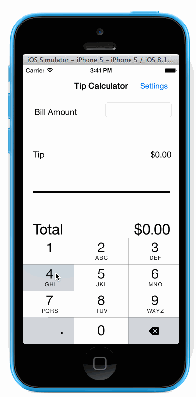

# Swift Tip Calculator
Because sometimes a TODO list is too hard as a first app, here's a tip calculator!

## What is this

This is an implementation of the Swift tip calculator built by following this wonderful [tutorial video](http://vimeo.com/102084767) published by CodePath.

## What's different

- There is one place where this app's implementation of [`ViewController.swift`] diverges from the code featured in the video. At [21:45](http://vimeo.com/102084767#t=21m45s) an internal method, `bridgeToObjectiveC` is used. I use `as NSString` instead.
        var billAmount = (billField.text as NSString).doubleValue

- A settings modal has been added. It allows the user to set a default tip.

## License

MIT
